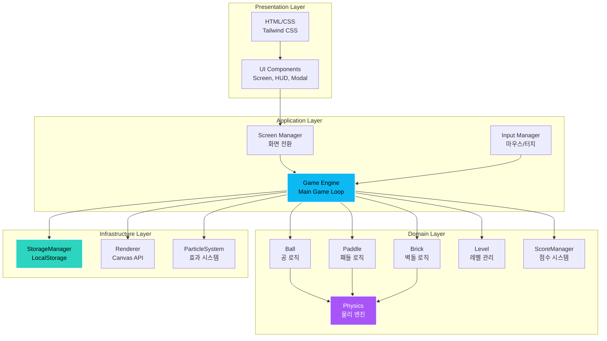
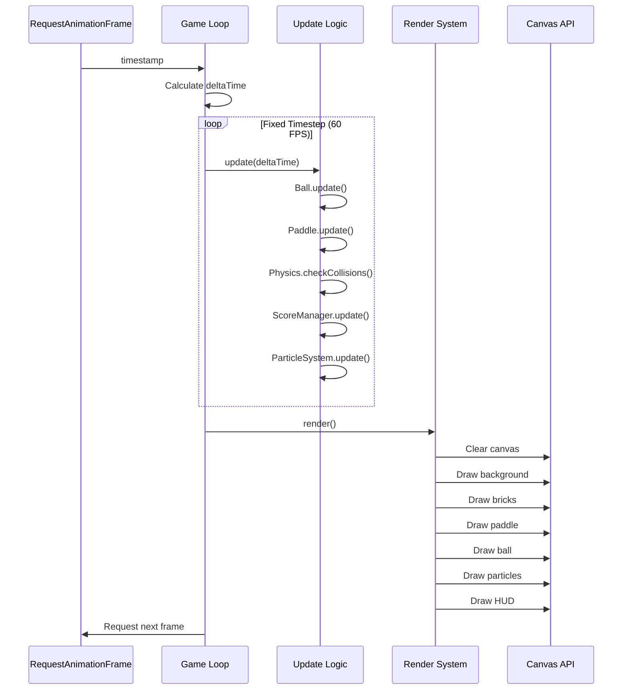
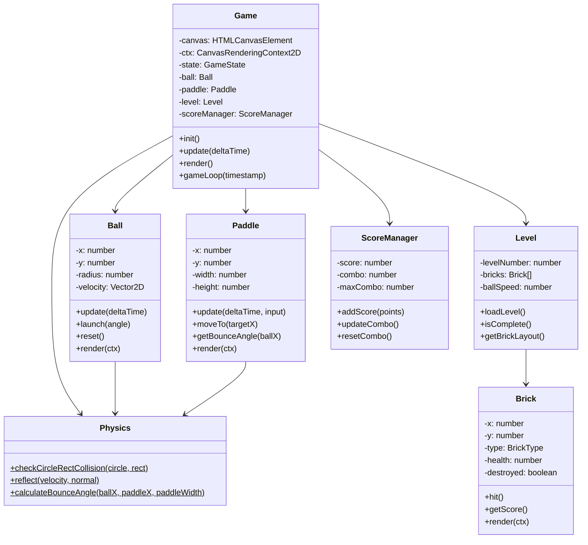
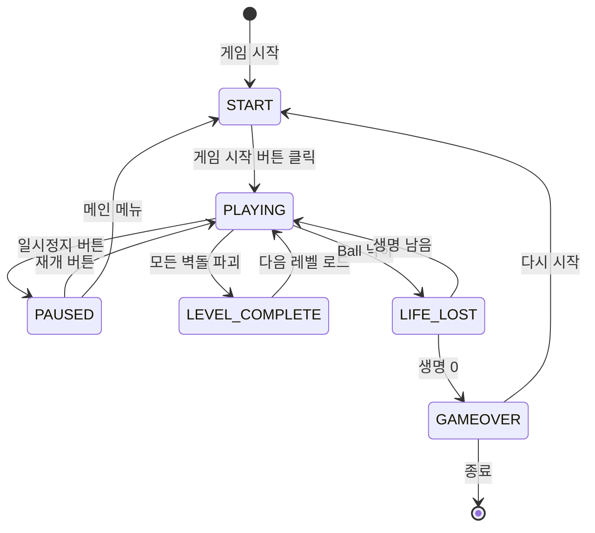

# 🎮 Neon Breaker

<div align="center">


[](https://tlstn3172.github.io/brick-break-demo/)
[](https://opensource.org/licenses/MIT)

**현대적인 웹 기술로 재해석한 클래식 벽돌 깨기 게임**

[🎮 Live Demo](https://tlstn3172.github.io/brick-break-demo/) | [📖 Documentation](./docs) | [🐛 Issues](https://github.com/tlstn3172/brick-break-demo/issues)

</div>

---

## 📌 프로젝트 소개

Neon Breaker는 클래식 벽돌 깨기 게임을 **현대적인 웹 기술과 디자인**으로 재해석한 프로젝트입니다. 단순한 게임 구현을 넘어, **엔터프라이즈급 소프트웨어 개발 방법론**을 적용하여 확장 가능하고 유지보수가 용이한 코드베이스를 구축했습니다.

### ✨ 주요 특징

- 🎨 **네온 스타일 UI/UX**: 다크 모드 기반의 세련된 네온 효과와 부드러운 애니메이션
- 🧪 **TDD 기반 개발**: 코어 로직에 대한 80% 이상의 테스트 커버리지
- 🏗️ **SOLID 원칙 준수**: 확장 가능하고 유지보수가 용이한 아키텍처
- 📱 **완벽한 반응형**: 모바일, 태블릿, 데스크톱 모든 기기 지원
- ⚡ **고성능**: 60 FPS 유지 및 최적화된 렌더링
- 🚀 **CI/CD 자동화**: GitHub Actions를 통한 자동 빌드 및 배포

---

## 🎯 기술적 우수성

### 1️⃣ 테스트 주도 개발 (TDD)

코어 로직의 모든 클래스는 **테스트 우선 개발 방식**으로 구현되었습니다.

```javascript
// 예시: Ball 클래스 테스트
describe('Ball', () => {
  test('should update position based on velocity', () => {
    const ball = new Ball(100, 100, 8, 300);
    ball.velocity = { x: 1, y: 0 };
    ball.update(1);
    expect(ball.x).toBe(400);
  });
});
```

**테스트 커버리지**: 코어 로직 80% 이상

### 2️⃣ SOLID 원칙 적용

각 클래스는 **단일 책임 원칙(SRP)**을 준수하며, 의존성 주입을 통해 **의존성 역전 원칙(DIP)**을 구현했습니다.

```javascript
// 단일 책임: Ball은 공의 동작만 관리
class Ball {
  update(deltaTime) { /* 위치 업데이트 */ }
  render(ctx) { /* 렌더링 */ }
}

// 단일 책임: Physics는 물리 계산만 담당
class Physics {
  static checkCollision(ball, brick) { /* 충돌 감지 */ }
  static reflect(velocity, normal) { /* 반사 계산 */ }
}
```

### 3️⃣ 성능 최적화

- **객체 풀링**: 파티클 시스템에서 객체 재사용으로 GC 부담 감소
- **레이어 분리**: 정적/동적 요소를 분리하여 렌더링 최적화
- **Fixed Timestep**: 안정적인 60 FPS 유지

```javascript
class ObjectPool {
  acquire() {
    return this.pool.length > 0 ? this.pool.pop() : this.createFn();
  }
  
  release(obj) {
    this.resetFn(obj);
    this.pool.push(obj);
  }
}
```

### 4️⃣ 모듈화 및 확장성

명확한 관심사 분리로 새로운 기능 추가가 용이합니다.

```
src/
├── game/       # 게임 로직 (Ball, Paddle, Brick, Physics)
├── ui/         # UI 컴포넌트 (Screen, HUD, Modal)
├── utils/      # 유틸리티 (Storage, Input)
└── config/     # 설정 및 상수
```

---

## 🏗️ 아키텍처

### 시스템 아키텍처



### 게임 루프 아키텍처



### 클래스 다이어그램 (코어 로직)



### 상태 관리 흐름



---

## 🛠️ 기술 스택

### Frontend
- **HTML5** - 구조 및 Canvas API
- **CSS3** - 스타일링 및 애니메이션
- **JavaScript (ES6+)** - 게임 로직
- **Tailwind CSS** - 유틸리티 기반 스타일링

### Build & Dev Tools
- **Vite** - 빌드 도구 및 개발 서버
- **Vitest** - 테스트 프레임워크
- **PostCSS** - CSS 전처리

### CI/CD & Deployment
- **GitHub Actions** - 자동 빌드 및 테스트
- **GitHub Pages** - 정적 사이트 호스팅

### Design
- **Google Fonts (Spline Sans)** - 타이포그래피
- **Material Symbols** - 아이콘 시스템

---

## 🚀 시작하기

### 필수 요구사항

- **Node.js** 18.x 이상
- **npm** 9.x 이상

### 설치 및 실행

```bash
# 저장소 클론
git clone https://github.com/tlstn3172/brick-break-demo.git
cd brick-break-demo

# 의존성 설치
npm install

# 개발 서버 실행 (http://localhost:3000)
npm run dev

# 프로덕션 빌드
npm run build

# 빌드 미리보기
npm run preview

# 테스트 실행
npm test

# 테스트 커버리지
npm run test:coverage
```

### 🎮 게임 플레이 방법

1. 개발 서버 실행 후 브라우저에서 http://localhost:3000/brick-break-demo/ 접속
2. 캔버스를 클릭하여 게임 시작
3. **마우스** 또는 **터치**로 패들을 좌우로 움직여 공을 받아내세요
4. 모든 벽돌을 깨뜨려 레벨을 완료하세요!

### 🎯 현재 구현 상태

✅ **완료된 기능:**
- Phase 1: 프로젝트 초기 설정 (Vite, Tailwind, Vitest)
- Phase 2: 코어 로직 (TDD, 73개 테스트 통과)
  - Physics, Ball, Paddle, Brick, Level, Storage, ScoreManager
- Phase 3: 게임 엔진 및 렌더링
  - Game 클래스, 게임 루프, 충돌 감지, 파티클 효과
  - Canvas 렌더링 (네온 효과, 그라데이션)

🎮 **게임 플레이 가능!**
- 기본 게임플레이 완전 작동
- 5개 레벨
- 점수 및 콤보 시스템
- 생명 시스템
- 파티클 효과

---

## 📁 프로젝트 구조

```
brick-break-demo/
├── docs/                      # 📚 프로젝트 문서
│   ├── PRD.md                # 요구사항 명세서
│   ├── TechSpec.md           # 기술 명세서
│   ├── TASKS.md              # 작업 목록
│   └── design/               # 디자인 파일
├── rules/                     # 📋 개발 규칙
│   ├── build-and-deployment.md
│   └── development-principles.md
├── src/                       # 💻 소스 코드
│   ├── scripts/
│   │   ├── game/             # 게임 로직 (TDD)
│   │   ├── ui/               # UI 컴포넌트
│   │   ├── utils/            # 유틸리티
│   │   └── config/           # 설정
│   ├── styles/               # 스타일시트
│   └── index.html            # 메인 HTML
├── .github/workflows/         # 🔄 CI/CD
└── package.json
```

---

## 🎮 게임 플레이

### 조작 방법
- **마우스**: 마우스를 좌우로 움직여 패들 제어
- **터치**: 화면을 터치하고 좌우로 드래그하여 패들 제어

### 게임 규칙
- 공을 패들로 받아 벽돌을 깨뜨리세요
- 벽돌 타입별 체력:
  - 🟢 **약한 벽돌** (틸): 1회 충돌로 파괴 (10점)
  - 🔵 **중간 벽돌** (블루): 2회 충돌로 파괴 (20점)
  - 🟣 **강한 벽돌** (보라): 3회 충돌로 파괴 (30점)
- 연속으로 벽돌을 깨면 콤보 보너스 획득
- 생명은 총 3개, 공을 놓치면 생명 감소
- 모든 벽돌을 깨면 다음 레벨로 진행

---

## 📊 개발 프로세스

### 개발 방법론

1. **요구사항 분석** - PRD 작성 및 디자인 검토
2. **기술 설계** - TechSpec 작성 및 아키텍처 설계
3. **작업 분해** - GitHub Issues로 작업 관리
4. **TDD 개발** - 테스트 작성 → 구현 → 리팩토링
5. **코드 리뷰** - SOLID 원칙 준수 확인
6. **CI/CD** - 자동 빌드, 테스트, 배포

### 품질 관리

- ✅ **테스트 커버리지**: 코어 로직 80% 이상
- ✅ **코드 리뷰**: SOLID 원칙 체크리스트
- ✅ **성능 모니터링**: 60 FPS 유지
- ✅ **크로스 브라우저**: Chrome, Firefox, Safari, Edge
- ✅ **반응형**: 모바일, 태블릿, 데스크톱

---

## 🎨 디자인 시스템

### 컬러 팔레트
- **Primary**: `#0db9f2` (네온 시안)
- **Background Dark**: `#101e22`
- **Accent Purple**: `#a855f7`
- **Accent Teal**: `#2dd4bf`

### 타이포그래피
- **폰트**: Spline Sans
- **웨이트**: 300, 400, 500, 600, 700

### 디자인 특징
- 다크 모드 기반 UI
- 네온 글로우 효과
- 부드러운 라운드 처리
- 그라데이션 및 블러 효과

---

## 📈 향후 계획

### Phase 2 (예정)
- [ ] 사운드 효과 및 배경 음악
- [ ] 파워업 시스템 (멀티볼, 패들 확장, 슬로우 모션)
- [ ] 추가 레벨 디자인 (10개 이상)
- [ ] 온라인 리더보드

### Phase 3 (예정)
- [ ] PWA 변환 (오프라인 지원)
- [ ] 다양한 게임 모드 (타임 어택, 엔드리스)
- [ ] 소셜 공유 기능
- [ ] 사용자 프로필 시스템

---

## 🤝 기여하기

이 프로젝트는 학습 및 포트폴리오 목적으로 제작되었습니다. 개선 제안이나 버그 리포트는 언제나 환영합니다!

1. Fork the Project
2. Create your Feature Branch (`git checkout -b feature/AmazingFeature`)
3. Commit your Changes (`git commit -m 'Add some AmazingFeature'`)
4. Push to the Branch (`git push origin feature/AmazingFeature`)
5. Open a Pull Request

---

## 📝 라이선스

이 프로젝트는 MIT 라이선스 하에 배포됩니다. 자세한 내용은 [LICENSE](LICENSE) 파일을 참조하세요.

---

## 👨‍💻 개발자

**개발자 이름**
- GitHub: [@tlstn3172](https://github.com/tlstn3172)
- Email: dev@example.com

---

## 🙏 감사의 말

이 프로젝트는 현대적인 웹 개발 기술과 소프트웨어 엔지니어링 원칙을 학습하고 적용하기 위해 제작되었습니다. 클래식 게임을 통해 **TDD, SOLID 원칙, 성능 최적화, CI/CD** 등 실무에서 요구되는 기술들을 경험할 수 있었습니다.

---

<div align="center">

**⭐ 이 프로젝트가 도움이 되었다면 Star를 눌러주세요! ⭐**

Made with ❤️ and ☕

</div>
